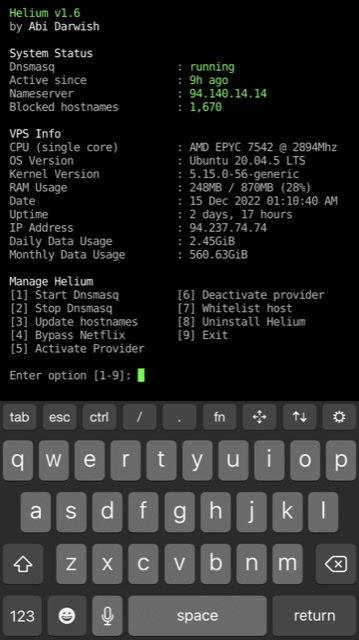

# Helium

[](https://www.gnu.org/licenses/gpl-3.0)

Helium is a dnsmasq installer autoscript. Helium will setup dnsmasq to block ads, tracker, malware, phishing, porn and many more.
  
<p align="center">
  
</p>

It helps you manage dnsmasq configuration by simply following the on-screen instructions as easy as 1, 2, 3.

<p align="center">
  
</p>

requirement : Debian/Ubuntu OS

To install, copy paste this command:

```
rm -rf /usr/local/sbin/helium && wget -q -O /usr/local/sbin/helium https://raw.githubusercontent.com/abidarwish/helium/main/helium.sh && chmod +x /usr/local/sbin/helium && helium
```
